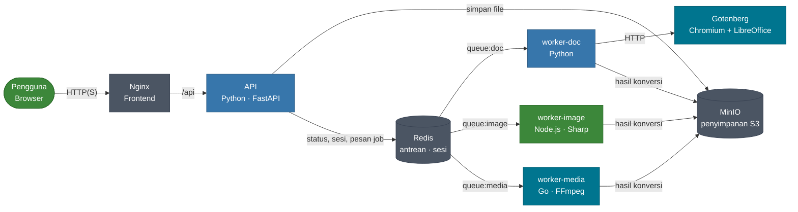
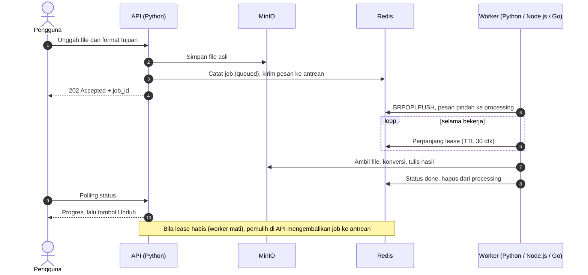

<div align="center">

# CloudConvert-X

**Konverter dokumen, gambar, audio, dan video berbasis microservices lintas bahasa.**

Python, Node.js, dan Go bekerja sama lewat antrean Redis dan protokol jaringan standar, tanpa saling memanggil kode.

[](https://github.com/akshakarya0-debug/cloudconvert-x/.github/workflows/ci.yml)


</div>

<!--
Tambahkan tangkapan layar ke docs/images/ lalu aktifkan blok di bawah:

<p align="center">
  
  
</p>
-->

## Fitur

- **Empat jenis file**: dokumen → PDF, konversi gambar, audio, dan video, dengan progres nyata.
- **Antarmuka web** dengan tarik-lepas hingga 10 file sekaligus, riwayat job, status layanan langsung, serta mode terang dan gelap.
- **Akun per pengguna**: tanpa pendaftaran terbuka, job hanya terlihat oleh pemiliknya.
- **Antrean tahan-gagal**: job dari worker yang mati di tengah proses dikembalikan ke antrean otomatis.
- **Mudah diskalakan**: tambah worker dengan satu perintah, tambah bahasa baru dengan mengikuti kontrak sederhana.

## Arsitektur



| Layanan | Teknologi | Peran |
|---|---|---|
| `frontend` | HTML/JS + Nginx | Menyajikan halaman web dan meneruskan `/api` ke API (Nginx tidak mengurus login) |
| `api` | Python, FastAPI | Login dan sesi, unggahan, status job, unduhan, pemulih job macet |
| `worker-doc` | Python | Dokumen → PDF lewat Gotenberg |
| `worker-image` | Node.js, Sharp | Konversi dan kompresi gambar |
| `worker-media` | Go, FFmpeg | Konversi audio dan video |
| `gotenberg` | Go | Render PDF (Chromium + LibreOffice) |
| `redis` | Redis | Antrean, status job, sesi, heartbeat |
| `minio` | Go | Penyimpanan objek kompatibel S3 |

Layanan tidak saling memanggil fungsi. Semuanya hanya memakai tiga protokol umum: **HTTP + JSON**, **protokol Redis**, dan **protokol S3**. Itu sebabnya bahasa pemrograman tiap layanan bebas dipilih.

### Alur satu konversi



## Mulai cepat

**Prasyarat:** Docker Engine dengan Compose v2, RAM 8 GB (4 GB untuk Docker), dan sekitar 6 GB disk kosong. Python, Node.js, Go, dan FFmpeg tidak perlu dipasang; semuanya ada di dalam kontainer. Detail di [REQUIREMENTS.md](REQUIREMENTS.md).

```bash
git clone https://github.com/USERNAME/cloudconvert-x.git
cd cloudconvert-x
cp .env.example .env                 # ganti MINIO_ROOT_PASSWORD
docker compose up -d --build         # build pertama beberapa menit
docker compose exec api python manage.py tambah-pengguna kamu@contoh.com --nama "Nama Kamu"
```

Buka **http://localhost:8080** dan masuk dengan akun tadi.

| Alamat | Isi |
|---|---|
| `http://localhost:8080` | Aplikasi web |
| `http://localhost:8000/docs` | Dokumentasi API (Swagger) |
| `http://localhost:9001` | Console MinIO (khusus admin) |

Uji end-to-end untuk ketiga bahasa:

```bash
CCX_EMAIL=kamu@contoh.com CCX_PASSWORD='kata-sandi' bash tests/smoke_test.sh
```

## Konfigurasi

Semua pengaturan ada di `.env` (contoh: `.env.example`).

| Variabel | Bawaan | Fungsi |
|---|---|---|
| `MINIO_ROOT_USER` / `MINIO_ROOT_PASSWORD` | `ccxadmin` / *(ganti)* | Kredensial MinIO |
| `S3_BUCKET` | `ccx` | Nama bucket |
| `SESSION_DAYS` | `7` | Lama sesi login |
| `MAX_UPLOAD_MB` | `200` | Batas ukuran per file (samakan dengan `client_max_body_size` di Nginx) |
| `IMAGE_MAX_WIDTH` / `IMAGE_QUALITY` | `2560` / `80` | Batas lebar dan kualitas hasil gambar |

> **MinIO:** image `minio/minio` sudah tidak tersedia di Docker Hub. Proyek ini memakai `cgr.dev/chainguard/minio` yang berjalan dengan `user: "0"` agar bisa menulis ke volume.

## Format yang didukung

| Jenis | Masuk | Keluar | Worker |
|---|---|---|---|
| Dokumen | doc, docx, xls, xlsx, ppt, pptx, odt, ods, odp, rtf, txt, html, md | pdf | `worker-doc` |
| Gambar | jpg, png, webp, avif, gif, tiff | jpg, png, webp, avif, tiff, gif | `worker-image` |
| Audio | mp3, wav, flac, m4a, ogg, aac, opus, wma | mp3, wav, ogg, flac, m4a | `worker-media` |
| Video | mp4, mkv, avi, mov, webm, flv, wmv, m4v | mp4, webm, mkv, dan ekstrak audio | `worker-media` |

Seluruh matriks ada di satu berkas: [`services/api/formats.json`](services/api/formats.json).

## Manajemen akun

Akun dibuat dan dikelola admin lewat terminal:

```bash
docker compose exec api python manage.py tambah-pengguna budi@contoh.com --nama "Budi"
docker compose exec api python manage.py daftar
docker compose exec api python manage.py ganti-password budi@contoh.com
docker compose exec api python manage.py nonaktifkan budi@contoh.com
```

## API

Semua endpoint selain `/api/ping` membutuhkan sesi login (cookie).

| Metode | Path | Fungsi |
|---|---|---|
| `POST` | `/api/auth/login` | Masuk (`email`, `password`) |
| `POST` | `/api/auth/logout` | Keluar |
| `GET` | `/api/auth/me` | Pengguna saat ini |
| `GET` | `/api/formats` | Matriks format |
| `POST` | `/api/jobs` | Buat job (form: `file`, `target`) → `202` + `job_id` |
| `GET` | `/api/jobs` | 20 job terakhir milik pengguna |
| `GET` | `/api/jobs/{id}` | Status dan progres |
| `GET` | `/api/jobs/{id}/download` | Unduh hasil |
| `GET` | `/api/health` | Status layanan, worker aktif, panjang antrean |

## Keandalan dan keamanan

- **Antrean tahan-gagal.** Worker mengambil pesan dengan `BRPOPLPUSH` ke daftar `processing` dan memperpanjang `lease` selama bekerja. Pemulih di API mengembalikan job yang lease-nya habis (maksimal 3 percobaan, lalu `failed`). Job bisa terproses lebih dari sekali; hasilnya menimpa kunci yang sama sehingga aman.
- **Autentikasi.** Kata sandi disimpan sebagai hash argon2. Sesi memakai cookie `HttpOnly` + `SameSite=Lax` (`Secure` di balik HTTPS); Redis hanya menyimpan hash token sesi.
- **Isolasi data.** Pengguna lain mendapat `404` untuk job yang bukan miliknya.
- **Perlindungan dasar.** Pembatasan percobaan masuk, pemeriksaan `Origin` pada permintaan ubah-data, dan unggahan tanpa sesi ditolak sebelum isi file dibaca.
- **Penghapusan otomatis.** File di MinIO dan status job kedaluwarsa setelah 24 jam.

## Menambah worker baru

Worker boleh ditulis dalam bahasa apa saja. Yang dibutuhkan hanya klien Redis dan S3:

1. Ambil pesan JSON dengan `BRPOPLPUSH queue:<nama> processing:<nama>`.
2. Set `lease:<job_id>` (TTL 30 detik) dan perbarui kira-kira tiap 5 detik selama bekerja.
3. Ambil file dari MinIO, konversi, tulis hasil ke `outputs/<job_id>/<nama>`.
4. Tulis `status`, `progress`, `output_key`, `output_name`, atau `error` ke hash `job:<job_id>`.
5. Hapus pesan dengan `LREM processing:<nama> 1 <pesan>` dan `DEL lease:<job_id>`.
6. Kirim heartbeat `worker:<jenis>:<host>` (TTL 15 detik) agar muncul di panel status.

Lalu daftarkan kategori di `formats.json` dan tambahkan satu blok di `docker-compose.yml`.

## Struktur proyek

```
cloudconvert-x/
├── docker-compose.yml
├── .env.example
├── services/
│   ├── api/            # Python: main.py, auth.py, manage.py, formats.json
│   ├── worker-doc/     # Python
│   ├── worker-image/   # Node.js
│   ├── worker-media/   # Go
│   └── frontend/       # index.html + nginx.conf
├── tests/              # smoke_test.sh
└── .github/workflows/  # CI
```

## Membuka ke internet

Aplikasi punya login tetapi belum punya kuota per pengguna, jadi bagikan hanya ke orang yang dikenal.

- Batasi port `8000` dan `9001` ke `127.0.0.1` di `docker-compose.yml`; cukup `8080` yang perlu dijangkau.
- Gunakan **Tailscale** untuk akses privat, atau **Cloudflare Tunnel** (dengan Cloudflare Access) untuk tautan web. Keduanya tetap bekerja di jaringan yang memakai CGNAT.
- Tambahkan `restart: unless-stopped` pada `redis`, `minio`, dan `gotenberg` agar pulih setelah reboot.

## Pemecahan masalah

| Gejala | Solusi |
|---|---|
| `minio` gagal pull | Pakai `cgr.dev/chainguard/minio:latest` (lihat [Konfigurasi](#konfigurasi)) |
| `permission denied` pada `docker.sock` | `sudo usermod -aG docker $USER`, lalu login ulang |
| `can't open file '/app/manage.py'` | Bangun ulang: `docker compose up -d --build api` |
| Tampilan tidak berubah setelah pembaruan | `docker compose up -d --build frontend`, lalu `Ctrl+Shift+R` |
| Lupa kata sandi | `manage.py ganti-password <email>` |
| Antrean selalu 0 di panel status | Wajar untuk job kecil yang selesai kurang dari 1 detik; coba dengan video panjang |
| Port bentrok | Ubah angka kiri pada `ports` di `docker-compose.yml` |

## Batasan yang diketahui

- Belum ada kuota per pengguna.
- Tipe file dicek lewat ekstensi, belum lewat magic bytes atau pemindai virus.
- Status job memakai polling, belum SSE.
- Unggahan melalui API, belum presigned URL.
- FFmpeg dengan libx264 berlisensi GPL; pahami implikasinya bila dikomersialkan.

## Peta jalan

- [x] Antrean tahan-gagal dengan retry otomatis
- [x] Login akun per pengguna
- [x] Antarmuka baru dengan mode terang dan gelap
- [ ] Kuota per pengguna, API key, dan webhook
- [ ] Worker baru: OCR (Tesseract), alat PDF, transkripsi audio
- [ ] Pipeline berantai (hasil satu job menjadi masukan job berikutnya)
- [ ] SSE menggantikan polling
- [ ] Presigned upload langsung ke MinIO
- [ ] Validasi magic bytes + ClamAV
- [ ] Orkestrasi di k3s dengan komponen HA

## Kontribusi

Issue dan pull request dipersilakan. Sebelum mengirim perubahan, pastikan `docker compose build` berhasil dan `tests/smoke_test.sh` lulus.

## Lisensi

Lihat berkas [LICENSE](LICENSE).
